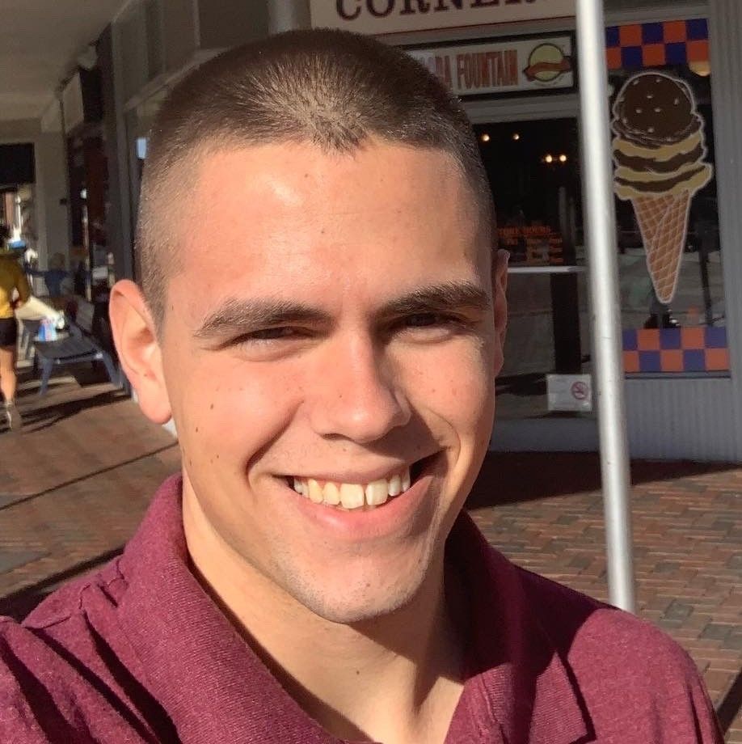
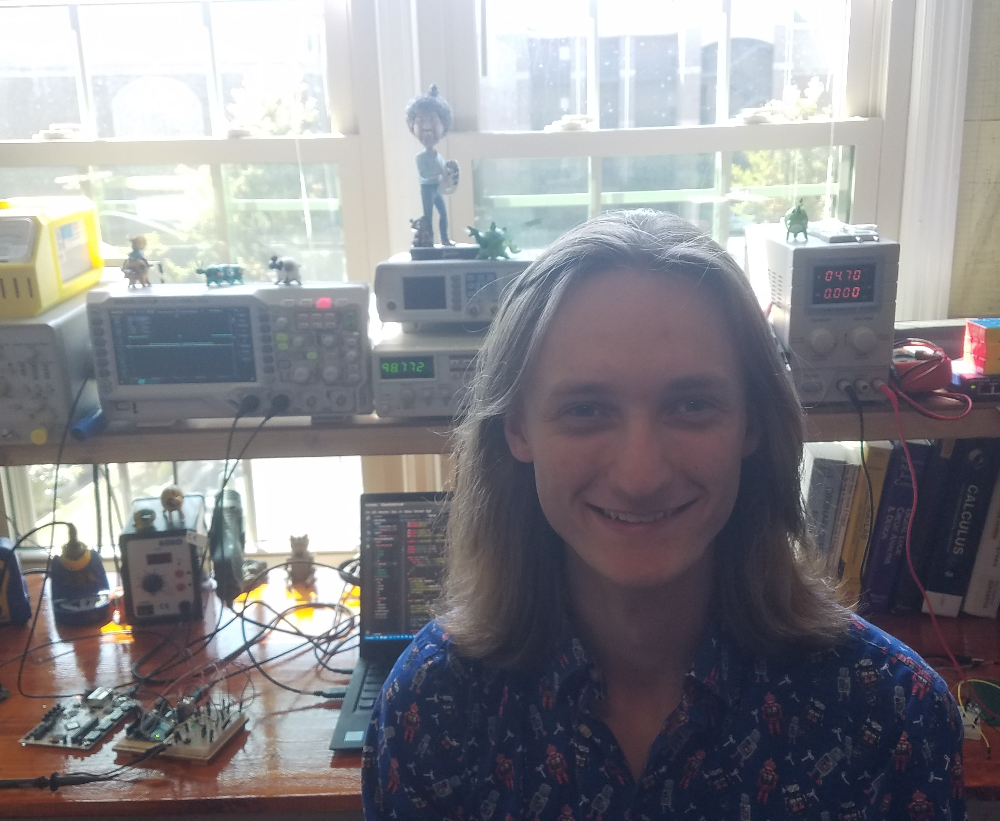

# Team Members

### Alex Jones - Group Leader 
```
Degree: Dual Bachelors in Electrical Engineering 
        and Computer Engineering

Project Role: Group Leader and Power Stage Designer

Outside of school I do hobbyist work in a number of 
fields, everything from software and FPGA's to robotics
and machining. I also swing dance and cook when I get
the time.
```


### Chase Flatau 
```
Degree: Bachelor of Electrical Engineering

Project Role: Power Stage Designer

I enjoy reading, outodoor activities, and hanging out 
with friends. I also enjoy designing and building 
circuits for my internship or outside.
```


### Rice Shelley 
```
Degree: Bachelor of Computer Engineering

Project Role: MCU board / embedded software 

FPGA enthusiast and amateur outdoorsman. Proficency 
in agile full stack development of grilled cheese 
sandwiches using both conventional oven 
and microwave technology.

```


### Al Spies
```
Degree: Bachelor of Electrical and Computer Engineering

Project Role: Interface Design / Website Management

I enjoy the outdoors when not busy with work, school,
or family events. With my free time, when there is 
some, I can be found fishing, golfing, or backcountry 
hiking/camping.
```


## [Vupiter](https://ams0187.github.io/Vupiter/) 

## [Design](https://ams0187.github.io/Vupiter/design)

## [Team Meetings](https://ams0187.github.io/Vupiter/minutes)
